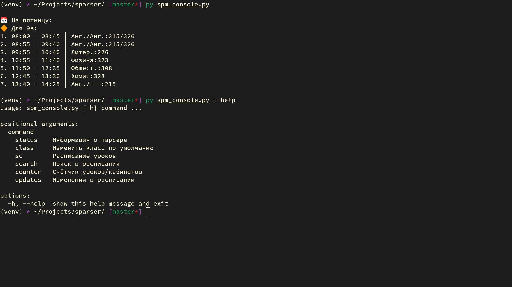

# SParser

> Парсер школьного расписания уроков.

Цель - **быстрое и удобное** получения расписания уроков.
А так же постараться **выжать максимум** возможностей из расписания.


## Установка

На примере Telegram бота с расписанием.

Загрузите этот репозиторий (напрмиер через `git clone`).
Создайте виртуальное окружение и установите необходимые зависимости.

```bash
git clone https://notabug.org/milinuri/sparser
cd sparser
python -m venv venv
source bin/activate
pip install -r requirements.txt
python telegram.py
```

После первого запуска `telegram.py` у вас появится файл `sp_data/token.json`,
куда вы и должны будете указать токен от вашего Telegram бота.
После этого снова запустите бота и всё будет работать.

## Немного о sp v3.x

Помимо актуальной версии (`sp/`) вы также найдёте `sp v3.x` (`sp3/`).
Данная версия счиатется устаревшей и не рекомендуется к использованию.
Тем не менее, в ней реализованы обёртки для консоли и Chio (ныне устаревшей).

> *Позднее все компоненты будут переписаны под актуальную версию sp.*


## Возможности парсера

На одном парсере всё не заканчивается.
В проекте представлен класс `sp.parser.Schedule` для работы с расписанием.
Например для поиска уроков/кабинетов и просмотра списка изменений. 

Также представлен генератор сообщений (`sp.spm`).
В нём находятся различные функции и класс `SPMessages`, для преобразования
результатов работы `Schedule` в текстовые сообщения например для чат-ботов.

Если вы хотите создать своего чат-бота, который бы отправлял расписание,
лучше использовать готовый генератор сообщений. 
Вам лишь остается прописать логику самого чат-бота.
Для примера использования генератора сообщений вы можете взглянуть на
telegram бота (`telegram.py`) или `spm_console.py`.

Доступные обёртки:

- Telegram бот
- Консоль (spm_console, sp v3.x)
- Плагин Чио (ВК, sp v3.x) 


Главная задача парсера - преобразовать расписание из гугл таблиц.
Кратко: **Гугл таблицы** -> **CSV** -> **json**.

Для повыешения скорости работы, все результаты работы хранятся в `sp_data/`.

`sp.filters`:

- Предоставляет класс фильтров для уточнения отображения расписания.
  - Принимает классы, дни, уроки, кабинеты.
  - Использутеся в большинстве функций проекта.

`sp.parser`:

- Отслеживание изменений во всём расписании.
- Получение индексов расписания. (`l_index`, `c_index`)
  - Словарь по урокам/кабиентом.
  - Какие, когда, где, для кого проводятся уроки/кабинеты.
- Парсер уроков. (`CSV -> Dict`)
- Умное обновление расписания.
  - Ежечасное сравнение хешей расписания.
  - Если хеши расписаний отличаются - начинается процесс обновелния.
  - Обновляется расписание, индексы, список изменений.
  - Результаты работы сохраняются в `sp_data/`.
- Получение списка уроков для выбранного класса.
- Получение списка обнлвений в расписаниии (использует фильтров).
- Поиск данных в расписании (использует фильтров).

`sp.spm` (Генератор сообщений):

- Отображение списка изменений в расписании
- Отображения списка уроков
  - С укзаанием номера урока, расписания звонков
  - Указатель на текущий урок
- Отображение результатов поиска в расписании
- Отображения отладочной информации о сборке и расписании.
- Управление данными пользователя по их User ID:
  - Получени данных пользователя.
  - Сохранение данных пользователя.
  - Сброс данных до значений по умолчанию.
  - Устанвка класса по умолчанию.
- Отправка расписания уроков. (использует фильтров)
  - Отображение изменений в расписании пользователя при наличии.
- Отправка расписания уроков на сегодня/завтра. (использует фильтров)
- Отправка счётчика уроков/кабинетов. (*требуется обновления*)

Обёртки не всегда поддерживают все 100% `sp.spm`!


## Telegram

Оригинал написал Артём Березин, за что ему спасибо.
Новый бот полностью отличается от оригинала в лучшею сторону.
Разобраться в боте не составит особого труда.
Для вас есть удобная клавиатура, чтобы вы могли быстро получить расписние.
Реализована большая всего функционал `SPMessages`, с некоторыми ограничениями.

Пока нет возможности представить все возможные фильтры через клавиатуру...
К примеру, просмотр списка обновлений одновременно по дням и классам.
Тем не менее, бот отлично подходит для решения большинства ваших задач.

Если вам нужны все 100% генератора сообщений, то обратитесь к консоли.


## Консоль



**spm_console для sp v5.0**:

Поддерживает все 100% генератора сообщений.
Всего 100 строчек кода.
Полезен для отладки и как пример использования генератора сообщений.

**Для sp v3.x**:

Поддерживает все 110% возможностей `sp v3.x`.
Собственный красивый генератор сообщений, ориентированный под консоль.
Когда-нибудь будет переписан для sp v4.x.


## Chio Plugin (sp v3.x)


Поддерживаются 100% возможностей пасрера `v3.x`.
Реализация "ленивых" оповещений.
В установленное время (с опозданием...) прилетает расписание.
Как установить и запустить Чио описано в её собственном репозитории.
Довольно простые команды.
Вряд-ли будет переписано под новую версию.

**Чио более не обновляется.**

Команды плагина:

- `/автопост [выкл/ЧАС]`: Настройка автопоста расписания
- `/класс [cl]`: Изменить класс по умолчанию на `cl`
- `/уроки [args]`: Получить расписание:
  - Если аргументы не указаны, получаем уроки на сегодня/завтра для класса по умолчанию
  - Если указать **класс** - для выбранного класса
  - Если указать **дни недели** - на эти дни
  - Если указать **урок** - поиск по урокам
  - Комбинировать эти аргументы можно как вашей душе угодно
- `/расписание [args]`: Расписание на неделю
  - Если ничего не указать, получаем расписание на неделю для класса по умолчанию
  - Если указать **класс** - для выбранного класса
  - Если указать **"изменения"** - получаем изменения в расписании 
- `/sparser`: Информация о парсере
- `/clessons [cl]`: Самыек частые уроки (всего/класс)
- `/ccabinets [cl]`: Самые частые кабинеты (всего/класс)
