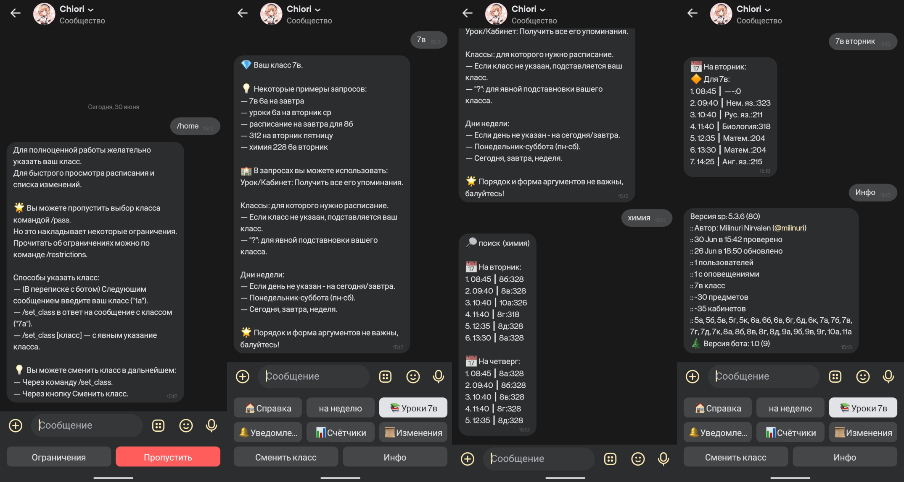
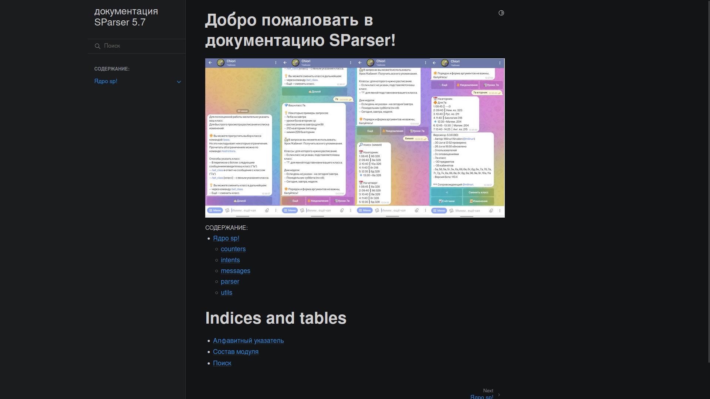

# SParser

> Самостоятельный парсер, генератор сообщений и чат-боты для школьного расписания уроков.


Приветствую в проекте.
Когда-то мне надоело смотреть расписание в гугл таблицах.
Оно просто долго открывалось, тормизили или не открывались вовсе.
Потому было принято решение написать дополнение к этому расписанию.

**И того мы получаем**:

- Автономный парсер расписания уроков.
- Возможность **быстро и удобно** просматривать расписание.
- Инструменты для работы с расписанием.
- Telegram и vk чат-боты.
- Отслеживание изменений в расписании.
- Автоматические оповещения.
- И многое другое.

Проект развивается и постепенно добалвяются новые функции.

## Установка

Скопируйте репозиторий проекта:
```bash
git clone https://notabug.org/milinuri/sparser
cd sparser
```

Установате зависимости через [poetry](https://python-poetry.org/):
```bash
# Только парсер и генератор сообщений
poetry install

# Если мы захотим запустить своего telegram бота
poetry install --with telegram
```

> Установка **Вк бота** закончится ошибкой из-за неразрешённых зависимостей.

Или через pip + Python venv:
```bash
# Создаём и активируем виртуальное окружение
# Запускать проект нужно тоже из виртуального окрежения
python -m venv venv
source venv/bin/activate

# Устанавливаем ВСЕ зависимости
pip install -r requirements.txt
```


## Запуск

На примере Telegran бота. (`v2.0 (sp v5.7)`).
Перед первым запуском скопируйте файл `.env.dist` в `.env`.
В файле `.env` укажите ваш Telegram токен бота.

```sh
# .env
...
TELEGRAM_TOKEN="YOUR_TELEGRAM_TOKEN_HERE
...
```

После указания токена вы можете запускать бота...

Через Poetry:
```
poetry run python telegram.py
```

Через Python venv.
```sh
source venv/bin/activate
python telegram.py
```

Запуск Вк бота происходит по похожему принципу.
Запишите в `.env` ваш токен от группы ВК.

```sh
# .env
...
VK_TOKEN="Ваш Вк токен Туть"
...
```

И после запускаете через *Python Venv*:
```sh
source venv/bin/activate
python -m sp_vk
```


## Чат-боты

### Telegram

Первую версию написал Артём Березин ([@optemikk](https://t.me/optemikk)), положив начало проекту.

Взаимодействие с ботом проиходит через запросы или клавиатуру.

В **текстовых запросах** вы указываете что вам нужно получить.
Будь то расписание для класса, урока или кабинета.
Вы можете уточнить свои запросы днём, классом, кабинетом, уроком.
Порядрок аргуметов в запроссе не важен, развлекайтесь.

**Клавиатура бота** позволяет дотянутся до всех основных разделов.
Вам не нужно писать однотипные запросы или вводить каждый раз команды.

Также для доступа к осноным разделам вы можете использовать команды.

**Функции бота**:

- Использование inline-клавиатуры.
- Использование текстовых запросов для получения расписания и поиска.
- Постраничное обучение написанию запросов (`/tutorial`).

- Управление классом по умолчанию (`/set_class`).
  - `->` Преимущества указанного класса (`/cl_features`).
  - `->` Не привязывать пользователя к классу (`/pass`).

- Домашнее сообщение (`/help`, `/start`).
  - Шпаргалка по написанию запросов.
  - `->` Дополниельная клавиатура (`/info`).
  - `->` Настройка уведомлений (`/notify`).
  - `->` Расписание на сегодня/завтра (`/sc`).

- Сообщение статуса (`/info`).
  - Статус `sp`.
  - Авторы и версия бота.
  - Время последнего автоматического обнолвения.
- Дополнительная клавиатура.
  - `->` Смена класса пользователя (`/set_class`).
  - `->` Просмотр списка изменений (`/updates`).
  - `->` Просмтр счётчиков расписания (`/counter`).
  - `->` Динамическая справка о написании запросов (`/tutorial`).
  - `->` Намерения пользвоателя (`/intents`).
- Просмотр списка изменений (`/updates`).
  - Клавиатура перемещения по страницам.
  - Переключение режима просмотра с общего на "для класса".
  - Клавиатура выбора намерения.
- Просмотр счётчиков расписания (`/counters`).
  - Переключение группы и режима просмотра.
  - Клавиатура выбора намерения.
- Настройка уведомлений бота (`/notify`).
  - Полное отключение уведомлений.
  - Сброс уведмолений.
  - Включение/отключение рассылки в указанный час.
- Расписание на сегодня/завтра (`/sc`).
  - Переключить просмотра с сегодня/завтра на неделю.
  - Выбор дня неделю для расписания.

- Намерения пользователя (`/intents`).
  - `->` Добавить новое намерение (`/add_intent`).
  - `->` Изменить намерение.
  - `->` Режим удаления намерений (`/remove_intents`).

- Добавить новое намерение (`/add_intent`):
  - Укажите имя намерения.
  - Укажите параметры намерения.

- Изменение намерения:
  - Изменить параметры намерения.
  - Удалить намерение.

- Режим удаления намерений (`/remove_intents`):
  - Удалить намерение по нажатию на его имя.
  - Удалить все намерения.


**Доступные счётчики**:

| counter  | target                  |
| -------- | ----------------------- |
| cl       | days, lessons. cabinets |
| days     | cl, lessons. cabinets   |
| lessons  | cl, days, main          |
| cabinets | cl, days, main          |


### vk (sp v5.7)



Разделы на фото:

- Смена класса (`/set_class`).
- Главное меню (справка).
- Результат запроса к расписанию.
- Информация о боте и парсере.

Копирует функции Telegram версии бота.
Иногда некоторые функции урезаются, некоторые напротив расшираются.
Из-за особенности платформы.

Вы так же можете использовать **текстовые запросы**.
**Клавиатура бота** в отличие от Telegram бота не прибита к сообщению,
а находится отдельно.
Это позоляет управлять всем ботов целиком, а не привзяываться к
отдельному сообщению.

Обновляется чуть реже, чем Telegram версия бота.
Если вам нужно обновление, то напишите об этом в
[Чат Telegram](https://t.me/+cXUXXlLgcJMzMzli)

[Статья о боте в Вк](https://vk.com/@chiorin-kak-poluchit-raspisanie).
Написана для более старой версии бота и может быть места устаревшей.

### Некоторые ограничения чат-ботов

Не смотря на почти полную поддержку генератора сообщений, существуют
некоторые ограничения, связанные с чатами.

**Настройка намерений**:
Пока нет возможности полноценно представить намерения через клавиатуру.
Это отражается на списке изменений и счётчиках.
Однако это не столь критично для большинства пользователей ботов.

> Примечание: Частично решена в Telegram бота, добавлением редактора
> намерений с версии v2.2.

**Ограничение длинны сообещний**.
Приходится соблюдать баланс между информативностью и читаемостью.
Порой это не всегда получается.
Это сказывается на удобсте использования и интуитивности бота.
Модет быть решена предварительным написанием справки об использовании.


## Консоль


Простая обёртка для работы с генератором сообщений.
Имеет достаточно простой интерфейс.
Не требует установки дополнительных зависимостей.
Использует все основные методы генератора сообщений.
Будет полезен для отладки работы парсера и генератора сообщений.
А также как пример кода для написания ваших собственных обёрток.

Вот пример некоторых команд:
```bash
# Получить справку по командам
python spcli.py --help

# Установка класс по умолчнию
python spcli.py --set-class 8а

# Быстрое получение расписания (если указан класс)
python spcli.py
```


## Возможности парсера

На одном парсере всё не заканчивается.
В проекте представлен класс `sp.parser.Schedule` для работы с расписанием.
Например для поиска уроков/кабинетов и просмотра списка изменений.

Также представлен генератор сообщений (`sp.messages`).
В нём находятся различные функции и класс `SPMessages`, для преобразования
результатов работы `Schedule` в текстовые сообщения например для чат-ботов.

Если вы хотите создать своего чат-бота, который бы отправлял расписание,
проще использовать готовый генератор сообщений.
Вам лишь остаётся прописать логику самого чат-бота, не задумываясь о
работе парсера и генератора сообщений.
Для примера использования генератора сообщений вы можете взглянуть на
`telegram.py` или `spcli.py`.

***

Главная задача парсера - преобразовать расписание из гугл таблиц.
Кратко: **Гугл таблицы** -> **CSV** -> **json**.

Для повышения скорости работы, все результаты работы хранятся в `sp_data/`.

`sp.counters` **Счётчики для расписания**:

- Предоставляет функции для подсчёта объектов в расписании.
- Доступные счётчики:
  - По классам: дни, уроки, кабинеты.
  - По дням: классы, уроки, кабинеты.
  - По индексам: уроки/кабинеты.
    - Уроки: классы, дни, кабинеты.
    - Классы: уроки, дни, кабинеты.
- Все счётчики используют фильтры для уточнения подсчётов.

`sp.intents` **Намерения**:

- Предоставляет класс намерений для уточнения результатов запросов.
- Используются в большинстве методах парсера и генератора сообщений.
- Имеется конструктор намерений:
  - Принимает классы, дни, уроки, кабинеты.
- Имеется парсер, преобразующий строковые аргументы в намерения.
  - Пример запроса: "Уроки для 7а на вторник, среду"

`sp.messages` **Генератор сообщений**:

- Отображение списка изменений в расписании.
- Отображения списка уроков.
  - С указанием номера урока, расписания звонков.
  - Указатель на текущий урок.
- Отображение результатов поиска в расписании.
- Отображение сгруппированных результатов счётчика.
- Отображения отладочной информации о парсере и генераторе сообщений.
- Управление данными пользователя по их `User ID`:
  - Получение данных пользователя.
  - Сохранение данных пользователя.
  - Сброс данных до значений по умолчанию.
  - Установка класса по умолчанию.
- Отправка расписания уроков. (использует намерения)
  - Отображение изменений в расписании пользователя при наличии.
- Отправка расписания уроков на сегодня/завтра. (использует намерения)

`sp.parser` **Парсер**:

- Отслеживание изменений во всём расписании.
- Получение индексов расписания (`l_index`, `c_index`).
  - Словарь по урокам/кабинетом.
  - Какие, когда, где и для кого проводятся уроки/кабинеты.
- Парсер уроков (`CSV -> Dict`).
- Умное обновление расписания.
  - Ежечасное сравнение хешей расписания.
  - Если хеши расписаний отличаются - начинается процесс обновления.
  - Обновляется расписание, индексы, список изменений.
  - Результаты работы сохраняются в `sp_data/`.
- Получение списка уроков для выбранного класса.
- Получение списка обновлений в расписании (использует фильтры).
- Поиск данных в расписании (использует фильтры).

`sp.utils` **Дополнительные инструменты**:

- Сжатие списка изменений в расписании.

## Документация



После завершения документации, многие разделы будут убраны из README.

Для всех заинтересованных в проекте появилась оффлайн документация.

Для сборки оффлайн документации. загрузите необходимые зависимости.

```bash
poetry install --with docs
```

Дальше перейдите в директорию `docs/` и выполните:

```bash
make html
```