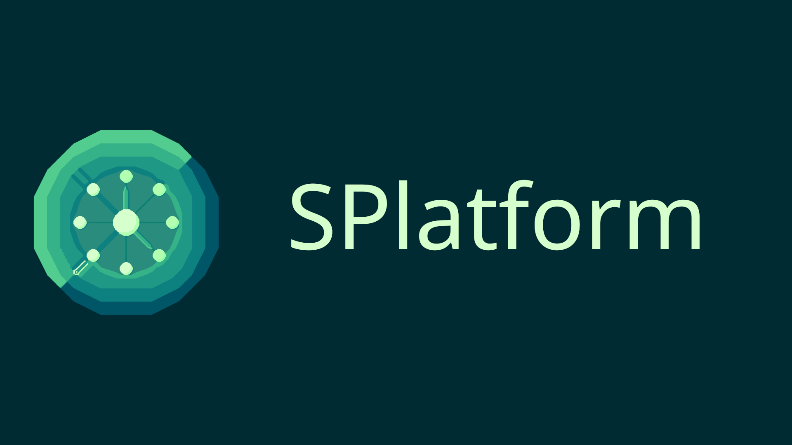
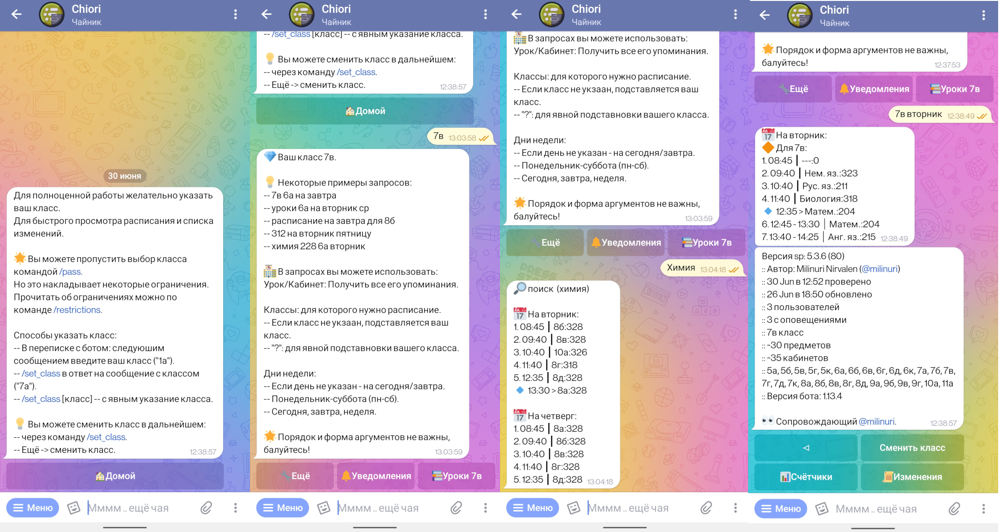
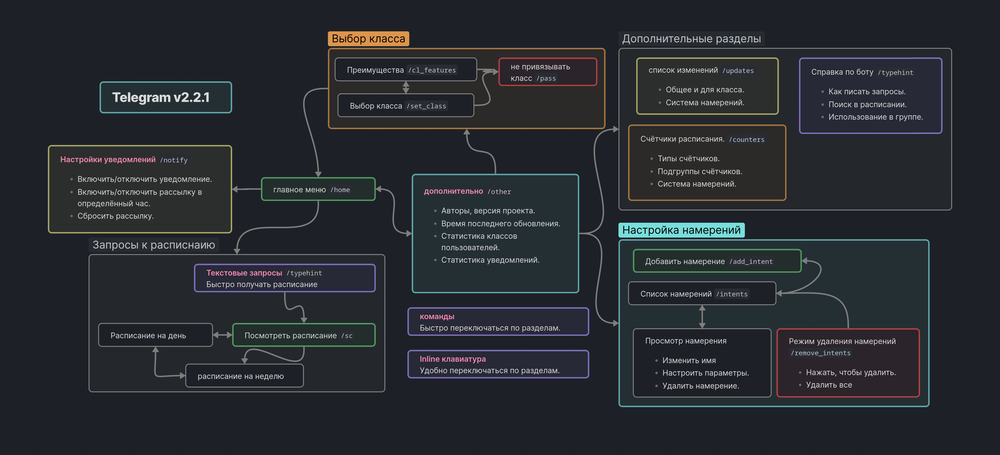

# SPlatform



> Самостоятельный платформа для расписания занятий.
> Включает в себя поставщики, классы представления, чат-боты и многое другое.

 <!-- some shields -->
<p align="center">
  <a href='https://sparser.readthedocs.io/ru/latest/?badge=latest'>
    
  </a>
  
  
  
</p>

Приветствую в проекте.
Когда-то мне надоело смотреть расписание в гугл таблицах.
Оно долго открывалось, тормизили или не открывались вовсе.
Так и появился проект для решения данной проблемы.

**И того мы получаем**:

- Автономный парсер расписания занятий.
- Возможность **быстро и удобно** просматривать расписание.
- Инструменты для работы с расписанием.
- `Telegram` и [vk](https://codeberg.org/Salormoon/spvk) чат-боты.
- Отслеживание изменений в расписании.
- Автоматические оповещения.
- *И многое другое*...

Проект активно развивается и постепенно добалвяются новые функции.
Почитать о всех возможностях вы можете в
[документации](https://sparser.readthedocs.io/ru/latest),
[Новостном TG канале](https://t.me/mili_qlaster).


## Установка (Telegram бот)

Скопируйте репозиторий проекта:
```bash
git clone https://codeberg.org/Salormoon/sparser
cd sparser
```

Установате зависимости через [poetry](https://python-poetry.org/):
```bash
# Только парсер и генератор сообщений
poetry install

# Если мы захотим запустить своего telegram бота
poetry install --with telegram
```

> Способ установки через venv считается устаревшим.


## Запуск

На примере Telegran бота. (`v2.4 (sp v6)`).
Перед первым запуском скопируйте файл `.env.dist` в `.env`.
В файле `.env` укажите ваш Telegram токен бота.

```toml
# .env
...
TELEGRAM_TOKEN="YOUR_TELEGRAM_TOKEN_HERE
...
```

После указания токена вы можете запускать бота...

Через Poetry:
```bash
poetry run python -m sp_tg
```

> Запуск других платформ происходит по похожему принципу.
> Посмотреть как запускать другие платформы в документации.

## Чат-боты

Обратите внимание что все платформы получаеют обновления в порядке очереди:

- `CLI`: Обновялется первой, получает все самоые свежие изменения сразу.
- `Tg`: Основной чат-бот, обновляется до последних версий sp.
- `Vk`: Намного реже получает обновления. Совместимость не гарантируется.

**Обратите внимание**: Репоизиторий вк бота переместился в
[spvk](https://codeberg,org/Salormoon/spvk).

Если вы хотите получить обновления для вк платформы, то можете написать нам в
[Tg чат](https://t.me/salorland).

### Telegram (v2.4 / sp v6)



> Как выглядит интерфейс Telegram бота.
> Не смотря на то что покзаана старая версия, глоббальных отличий в
> испрользовании нету.

Первую версию написал замечательный [@optemikk](https://t.me/optemikk),
положив начало проекту.

Взаимодействие с ботом проиходит через запросы или клавиатуру.

- В **текстовых запросах** вы указываете что вам нужно получить.
  Будь то расписание для класса, урока или кабинета.
  Вы можете уточнить свои запросы днём, классом, кабинетом, уроком.
  Порядрок аргуметов в запроссе не важен, развлекайтесь.

- **Клавиатура бота** позволяет дотянутся до всех основных разделов.
  Вам не нужно писать однотипные запросы или вводить каждый раз команды.

Также для доступа к осноным разделам вы можете использовать **команды**:

- `/sc`: Быстро получить расписание на сегодня/завтра.
- `/week`: Расписание не всю неделю.
- `/updates`: Изменения в расписании.
- `/notify`: Настроить уведомления.
- `/tutorial`: Маленькая справка как писать запросы к расписанию.
- `/set_class`: Изменить класс по умолчанию.
- *И прочие команды...*



Более наглядно все функции бота иллюстрирует следующая схема.
Она отображает все разделы бота, доступ к некоторым можно получить
прямо, использую команды.
Стрелками же показаны как вы можете перемещаться по разделам при
помощи inline-клавиатуры.


### Некоторые ограничения чат-ботов

Не смотря на почти полную поддержку генератора сообщений, существуют
некоторые ограничения, связанные с чатами.

**Настройка намерений**:
Пока нет возможности полноценно представить намерения через клавиатуру.
Это отражается на списке изменений и счётчиках.
Однако это не столь критично для большинства пользователей ботов.

> Примечание: Частично решена в Telegram бота, добавлением редактора
> намерений с версии v2.2.

**Ограничение длинны сообещний**.
Приходится соблюдать баланс между информативностью и читаемостью.
Порой это не всегда получается.
Это сказывается на удобсте использования и интуитивности бота.
Модет быть решена предварительным написанием справки об использовании.


## Консоль


Простая обёртка для работы с генератором сообщений.
Имеет достаточно простой интерфейс.
Не требует установки дополнительных зависимостей.
Использует все основные методы генератора сообщений.
Будет полезен для отладки работы парсера и генератора сообщений.
А также как пример кода для написания ваших собственных обёрток.

Вот пример некоторых команд:
```shell
# Получить справку по командам
python spcli.py --help

# Установка класс по умолчнию
python spcli.py user class 8а

# Быстрое получение расписания (если указан класс)
python spcli.py
```


## Поддержка

Мы будем очень рады, если вы поддержите проект звёздочками.
Вы можете свободно предлагать свои идеи и правки.

Также стоит отметить что проект распространяется под свободной лицензией.
Это значит что вы можете брать и использовать код в своих целях.
Мы также предоставляем документацию, чтобы вам было удобнее разбираться
во всех компонентах.

Мы будем очень рады, если вы оставите свой вклад.
