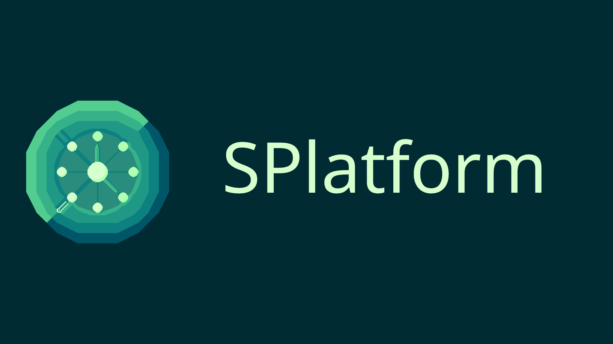

SPlatform
=========

.. Some shields
.. image:: https://img.shields.io/badge/dynamic/toml?url=https%3A%2F%2Fcodeberg.org%2FSalormoon%2Fsparser%2Fraw%2Fbranch%2Fmain%2Fpyproject.toml&query=tool.poetry.version&prefix=v&label=Ver&color=green
   :alt: Version

.. image:: https://img.shields.io/badge/dynamic/toml?url=https%3A%2F%2Fcodeberg.org%2FSalormoon%2Fsparser%2Fraw%2Fbranch%2Fmain%2Fpyproject.toml&query=tool.poetry.license&label=License&color=red
   :alt: License

.. image:: https://img.shields.io/badge/dynamic/toml?url=https%3A%2F%2Fcodeberg.org%2FSalormoon%2Fsparser%2Fraw%2Fbranch%2Fmain%2Fpyproject.toml&query=tool.poetry.dependencies.python&label=Python
   :alt: Python

приветствуем в платформе распространения расписания.
Задача проекта - максимально быстро и удобно работать с расписанием
занятий.

**И того мы получаем**:

- **Автономный парсер** расписания занятий.
- Возможность **быстро и удобно** просматривать расписание.
- **Инструменты** для работы с расписанием.
- Telegram и vk чат-боты.
- Отслеживание изменений по всему расписанию.
- Автоматические **оповещения** об изменениях.
- И многое другое...

Проект активно развивается и дополняется различным функционалом.

Вы и сами можете попробовать Telegram бота -
`@mili_sp_bot <https://t.me/mili_sp_bot>_`

.. note:: Проект постепенно меняет название.

   С ``SParser`` на ``SPlatform``, чтобы подчеркнуть, что это не просто
   парсер расписания, а целая платформа для работы с расписанием
   внутри удобной обёртки.

.. hint:: Не знаете с чего начать?

   Если вы хотите настроить **собственного бота**, то прочитайте раздел
   :ref:`Установка <install>`.

   Если вас интересует **техническая реализация** компонентов, то
   можете заглянуть :ref:`Ядро SPlatform <spcore>`.

Содержание
----------

.. toctree::
   :maxdepth: 2

   install
   wrappers/index
   sp/index
   changelog
   contributing
